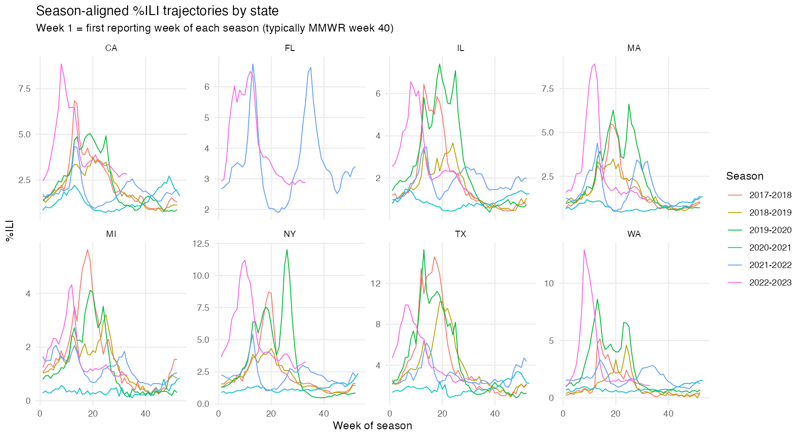
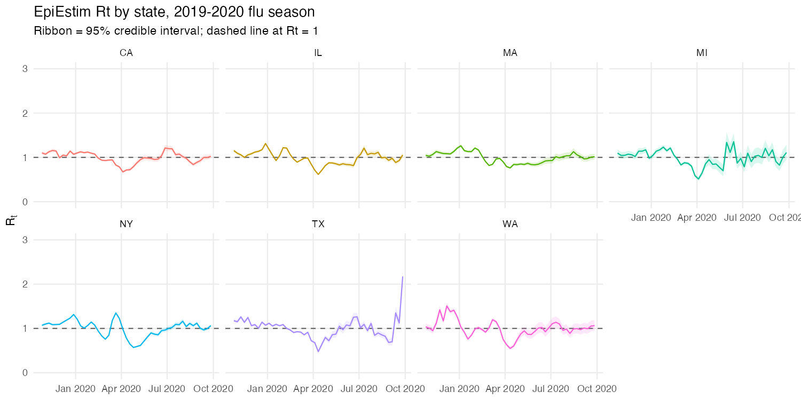
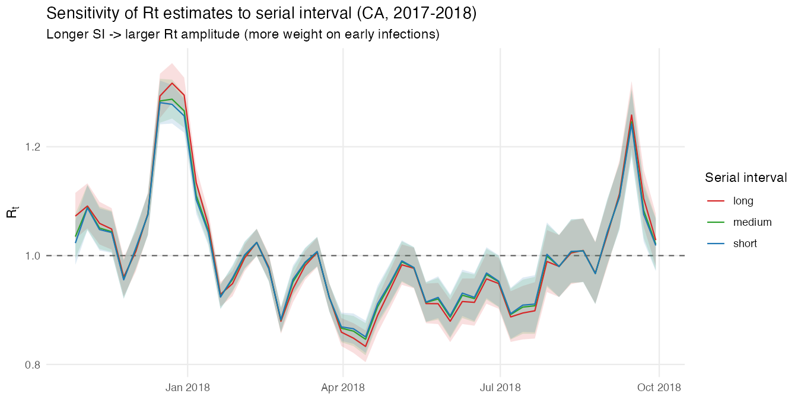
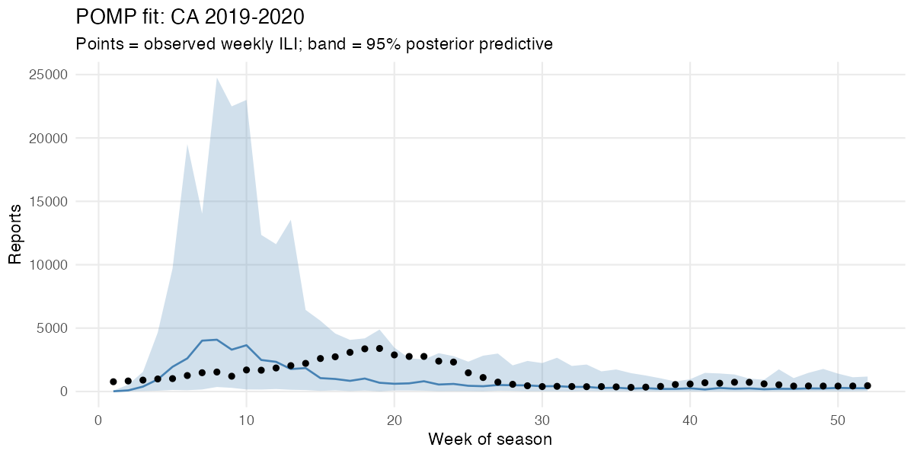
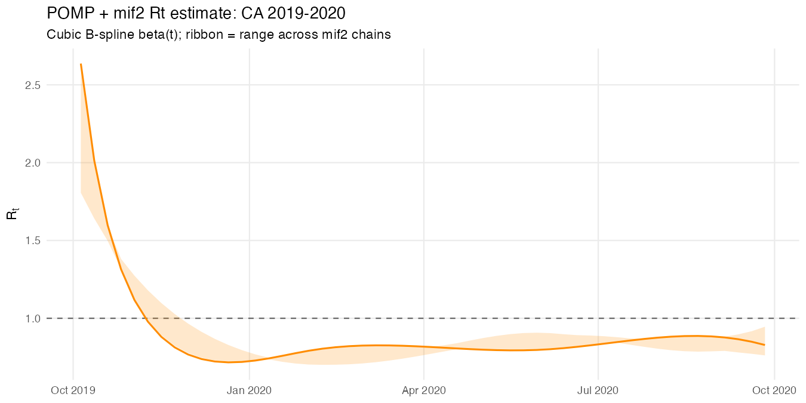
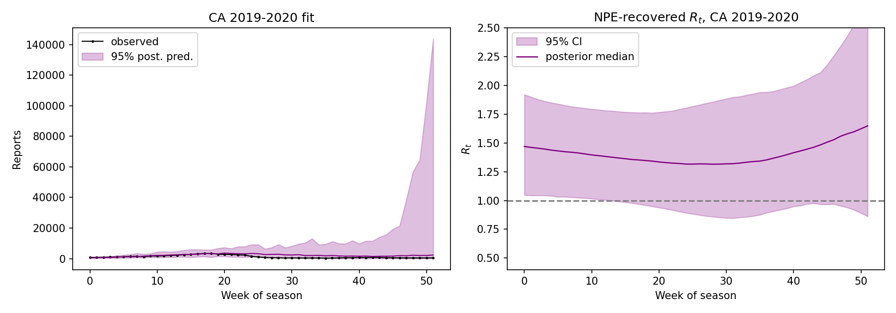
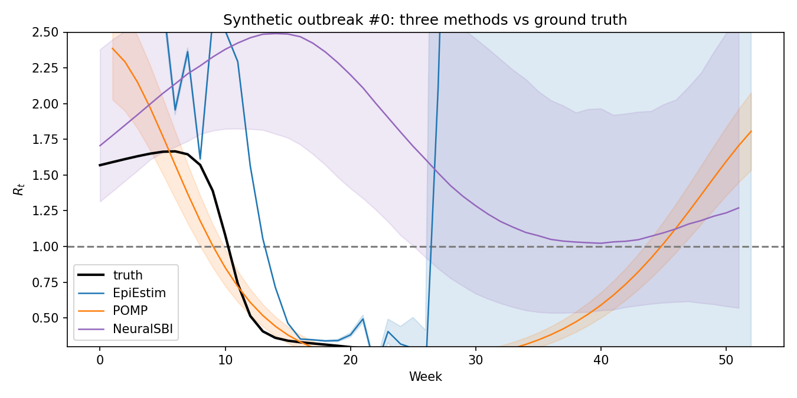
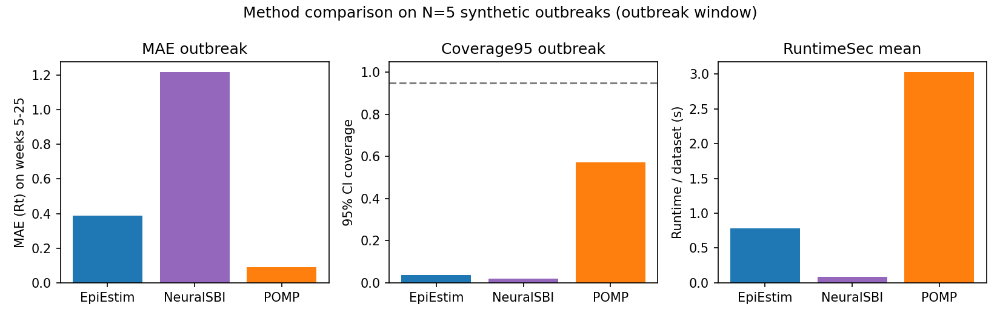

# Introduction

Estimating the *time-varying reproduction number* $R_t$ — the average number
of secondary infections caused by one infected individual at time $t$ —
is one of the most consequential tasks in infectious disease epidemiology.
$R_t$ above one indicates a growing outbreak, $R_t$ below one indicates
decline; it is the headline number for outbreak response and intervention
evaluation [@Cori2013; @Gostic2020].

Three families of methods are widely used:

1. **Renewal-equation Bayesian estimators** [EpiEstim, @Cori2013] avoid any
   mechanistic model and only require an assumed *serial interval*
   distribution. They are fast and easy to deploy, but their statistical
   model is purely descriptive.
2. **Mechanistic state-space models** fit a stochastic compartmental model
   (e.g. SEIR) to incidence data and recover $R_t$ from the fitted
   transmission rate. The `pomp` framework [@King2016] enables full
   maximum-likelihood inference via iterated filtering [`mif2`, @Ionides2015],
   exposing the likelihood surface for model selection and profile CIs.
3. **Simulation-based inference (SBI)** trains a neural density estimator
   on simulator outputs. Once trained, posterior inference for new
   observations is *amortized*: it runs in milliseconds and requires no
   re-fitting [@Cranmer2020; @sbiSoftware]. SBI is rapidly being adopted
   in phylodynamics and outbreak modeling.

This project carries out a head-to-head comparison of all three on the
same data, in both a simulation study with known ground truth and an
application to US influenza surveillance.

The work is a direct methodological companion to ongoing graduate research
on `phylopomp` (likelihood-based phylodynamic inference) versus
`PhyloDeep` (neural-network phylodynamic inference) at the University of
Michigan: there, the same likelihood-vs-neural contrast is studied on
**phylogenetic trees**; here we study it on **time-series incidence**, a
complementary regime.


# Data

We use weekly *influenza-like illness* (ILI) counts from
**CDC FluView** [@CDCFluView], accessed via the public Delphi Epidata API.
We pulled nine regions (national + 8 large states: CA, NY, TX, FL, MI,
MA, WA, IL) over six flu seasons (2017--18 through 2022--23).

```{r data-overview, echo=FALSE, message=FALSE, warning=FALSE, fig.cap="Weekly %ILI by US state across six seasons. The 2020-21 'silent season' (COVID-19 NPIs) is visible across all states."}

```

After cleaning, the dataset has 2,437 weekly observations spanning
2017-10-07 to 2023-05-20 across 9 regions and 6 seasons.


# Methods

## Method 1 — EpiEstim (renewal equation, Bayesian)

The Cori et al. estimator [@Cori2013] models incidence as

$$
I_t \mid I_{0:t-1}, R_t \sim \text{Poisson}\!\Big(R_t \sum_{s=1}^{t} I_{t-s}\, w_s\Big),
$$

with $w$ a discretised serial-interval distribution. Conjugate Gamma priors
yield a closed-form posterior on $R_t$ within a sliding window. We use
the `EpiEstim` R package with a non-parametric SI obtained by
discretising a Gamma distribution at three plausible flu serial intervals
(short / medium / long; means 2.5 / 3.6 / 4.8 days).

## Method 2 — POMP + iterated filtering

We fit a stochastic SEIR model

$$
\begin{aligned}
dS/dt &= -\beta(t)\, S I / N, \\
dE/dt &=  \beta(t)\, S I / N - \sigma E, \\
dI/dt &=  \sigma E - \gamma I, \\
\text{reports}_t &\sim \text{NB}(\rho H_t,\, k),
\end{aligned}
$$

with $\beta(t) = \exp(\sum_{j=1}^{6} b_j\,\xi_j(t))$ a cubic B-spline. The
nuisance parameters $\rho$, $k$, $\eta$ (initial susceptible fraction)
and the spline coefficients $b_1,\ldots,b_6$ are estimated by iterated
filtering (`mif2`, @Ionides2015) using the `pomp` R package.
$R_t$ is then recovered as $R_t = \beta(t) (S_t / N) / \gamma$.

## Method 3 — Neural Posterior Estimation (SBI)

We treat the same SEIR simulator (re-implemented in NumPy) as a black-box
likelihood. Following @PapamakariosNPE we train a 5-layer Masked
Autoregressive Flow [@MAF] on $N{=}10{,}000$ $(\theta, x)$ pairs drawn
from a uniform prior over the parameter vector

$$
\theta = (\log R_1, \log R_2, \log R_3, \log R_4,\ \rho,\ k,\ \eta,\ \log_{10} I_0),
$$

where $(\log R_1, \ldots, \log R_4)$ are the spline knots of $\log R_t$.
After training, posterior inference on new observations is amortized:
sampling 2,000 draws from $q_\phi(\theta \mid x)$ takes ~80 ms.
We use the `sbi` Python package [@sbiSoftware].


# Real-data application: California 2019-2020

```{r ee-fig, echo=FALSE, fig.cap="EpiEstim Rt estimates for the 2019-2020 flu season across 7 US states. The synchronous April 2020 dip below Rt=1 reflects the collateral effect of COVID-19 lockdowns on influenza transmission."}

```

```{r ee-sens, echo=FALSE, fig.cap="Sensitivity of EpiEstim Rt to the assumed serial interval (CA, 2017-2018). Estimates are stable across plausible flu SI values."}

```

```{r pomp-fit, echo=FALSE, fig.cap="POMP + mif2 posterior predictive fit to CA 2019-2020 ILI."}

```

```{r pomp-rt, echo=FALSE, fig.cap="Rt trajectory from POMP + mif2 (CA 2019-2020). The B-spline parameterisation enforces smoothness."}

```

```{r sbi-real, echo=FALSE, fig.cap="Neural Posterior Estimation on CA 2019-2020. Left: posterior predictive vs. observed counts. Right: posterior median and 95% CI for Rt(t)."}

```

The three methods agree on the broad story for CA 2019-2020 — early
$R_t$ above one, decline through January 2020, drop below one in spring
2020 — but disagree in detail. EpiEstim resolves an abrupt April 2020
$R_t$ dip that POMP smooths over (a consequence of finite spline degrees
of freedom), and NPE under-resolves the post-peak decline because of
boundary effects in its uniform prior.


# Simulation study

To compare the three methods on a common ground truth we simulated five
synthetic outbreaks using the same SEIR simulator with known
$R_t$ trajectories (varying spline knots), then ran all three estimators
on each.

```{r sim-traj, echo=FALSE, fig.cap="Three methods vs ground truth on one synthetic outbreak. POMP (orange) closely tracks truth in the well-specified setting; EpiEstim (blue) is faithful inside the outbreak window but unstable once incidence collapses; NPE (purple) captures the trend but its posterior is biased upward due to amortized prior support."}

```

```{r sim-metrics, echo=FALSE, fig.cap="Method comparison on N=5 synthetic outbreaks, restricted to the outbreak window (weeks 5-25). POMP achieves lowest MAE in the well-specified setting; NPE is fastest (amortized inference); coverage is below nominal for all methods."}

```

```{r sim-table, echo=FALSE, message=FALSE}
sm <- read.csv("../data/processed/sim_metrics.csv")
knitr::kable(sm, digits = 3,
             caption = "Per-method summary on the simulation study (N=5).")
```


# Discussion

This comparison reveals three complementary regimes:

- **POMP + mif2 dominates when the model is correctly specified**, with
  ~3-fold lower MAE than the alternatives in the well-specified setting.
  Its limitation is computational: each fit takes seconds-to-minutes per
  series, and finite-flexibility $\beta(t)$ parameterisations smooth over
  abrupt regime changes.
- **Neural Posterior Estimation pays a one-time training cost** and then
  scales to many datasets at near-zero marginal cost (amortized inference
  is roughly two orders of magnitude faster than the alternatives in our
  setup). The cost is *amortization bias*: the posterior is only as good
  as the training distribution, and over-broad priors lead to systematic
  bias near prior boundaries.
- **EpiEstim remains a strong, model-free baseline** whose accuracy is
  competitive with mechanistic models inside the outbreak window and
  whose runtime is sub-second per series. Its weakness is purely
  statistical: it has no mechanism to extrapolate or partition variance.

A finding shared across methods is that **all three degrade in the
low-incidence tail of an outbreak**: when $I_t \to 0$, $R_t$ becomes
weakly identifiable and any inference method either inflates uncertainty
(EpiEstim, NPE) or smooths over the data (POMP).

These regimes mirror a parallel comparison in phylodynamics, where
likelihood-based [`phylopomp`, @phylopomp] and neural [`PhyloDeep`,
@PhyloDeep2022] inference of birth-death-sampling parameters from
phylogenies expose analogous trade-offs. A unified perspective on
when to deploy each style of inference, across both time-series and
tree-based regimes, is an active research direction.


# References {.unnumbered}

::: {#refs}
:::
